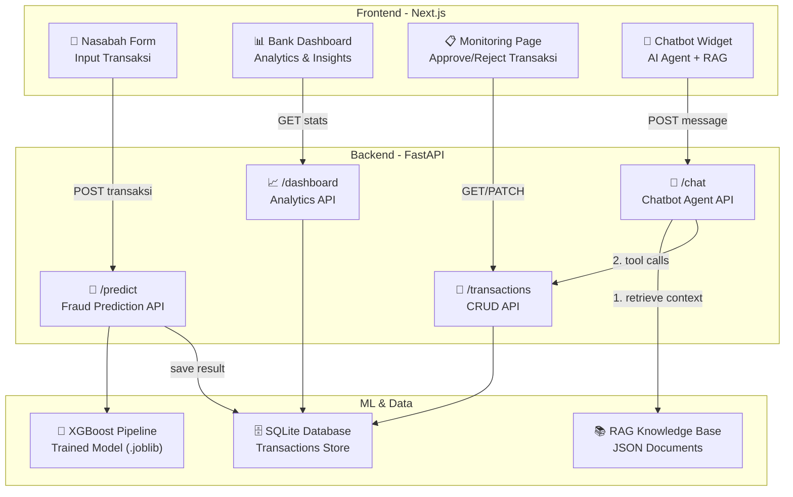
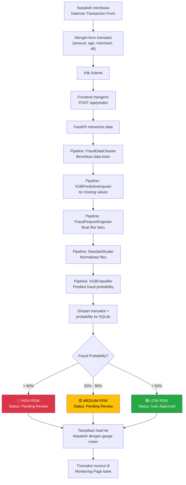
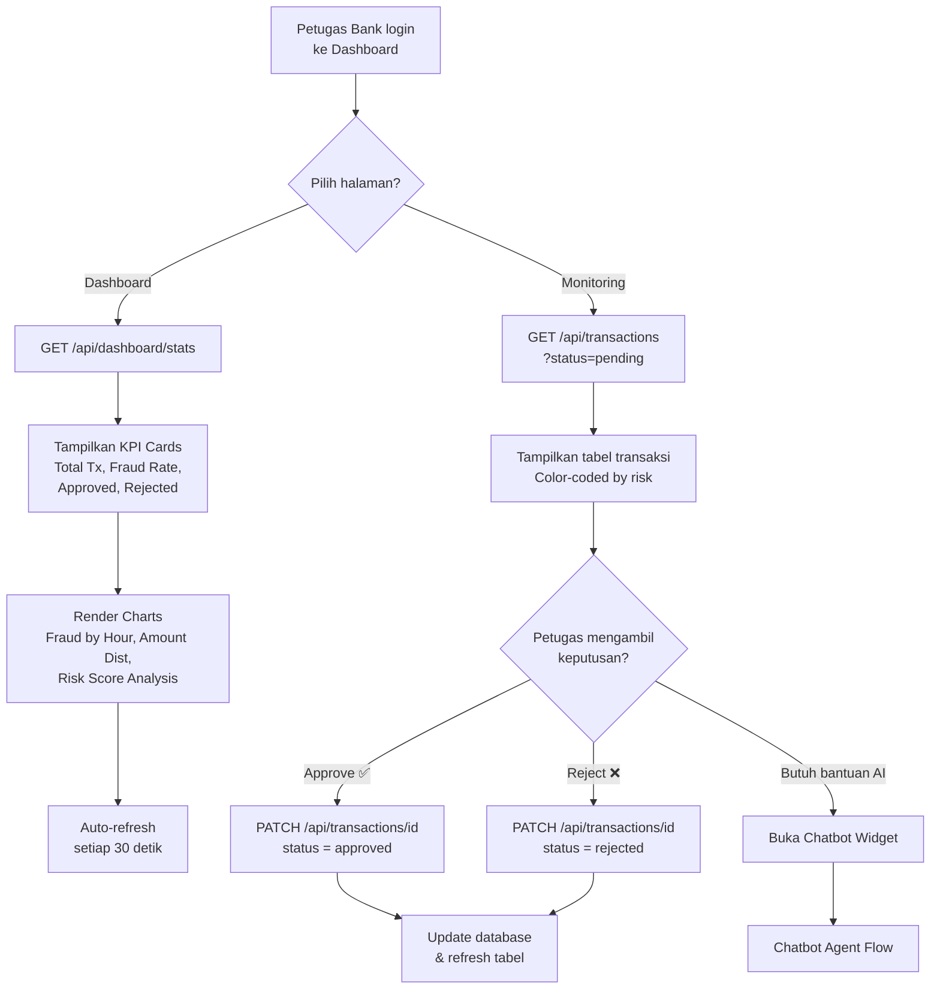
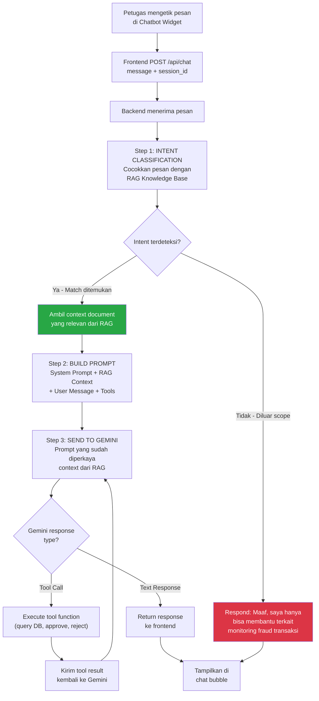
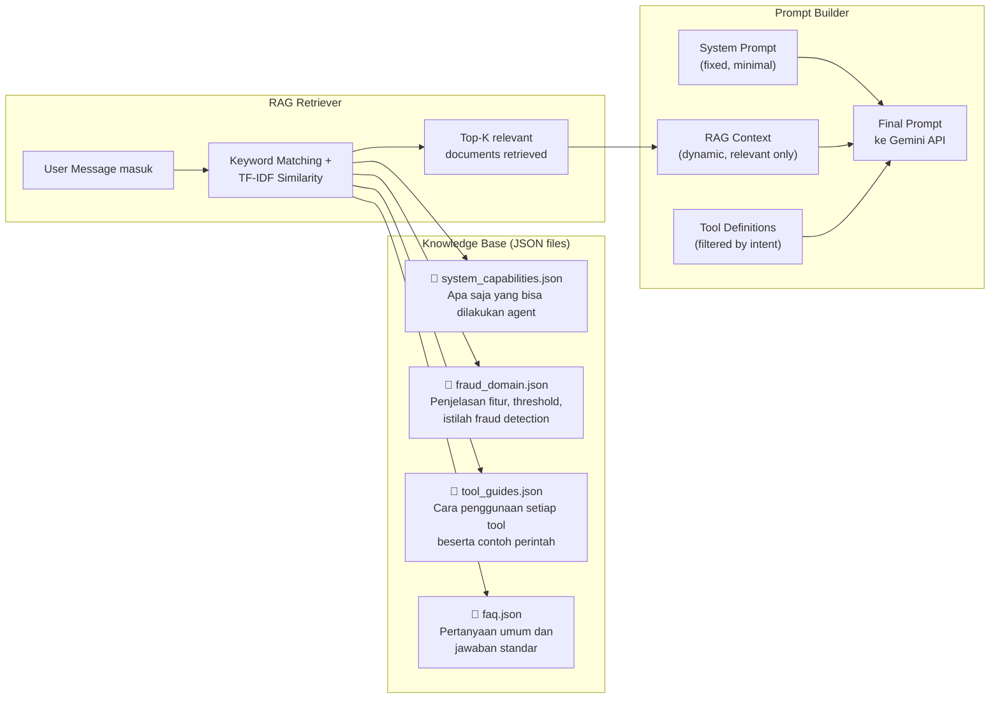
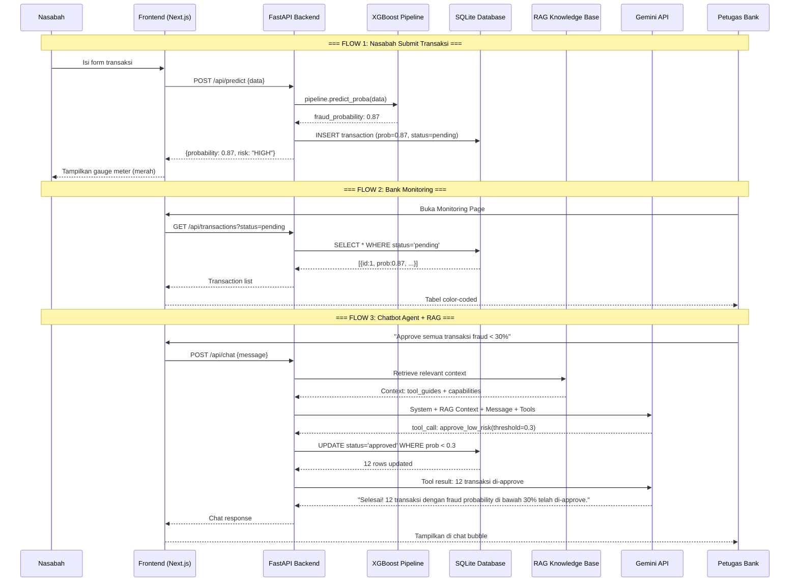

# Dokumentasi Alur dan Struktur Proyek: Transaction Fraud Monitoring System

Dokumen ini merangkum keseluruhan struktur, arsitektur, dan alur kerja (flow) dari proyek **Transaction Fraud Monitoring System**. Rangkuman ini dikompilasi dari berbagai dokumen perencanaan dan spesifikasi teknis untuk memberikan pandangan menyeluruh (helicopter view) yang dapat digunakan sebagai bahan laporan atau referensi utama proyek.

---

## 1. Gambaran Umum (Overview)

Proyek ini adalah sebuah **full-stack production ML system** untuk memantau dan mendeteksi penipuan (fraud) pada transaksi secara *end-to-end* dan *real-time*. Sistem ini memanfaatkan model **XGBoost** untuk prediksi probabilitas fraud dan menampilkan hasilnya melalui dashboard interaktif.

**Teknologi Utama (Tech Stack):**
*   **Machine Learning**: Python, Scikit-Learn, XGBoost, Pandas.
*   **Backend API**: FastAPI, Pydantic, Uvicorn.
*   **Database**: PostgreSQL (untuk produksi) / SQLite (untuk pengembangan).
*   **Frontend**: Next.js, React (menggunakan App Router dan Tailwind/Vanilla CSS dengan dark theme).
*   **AI Agent**: OpenAI (Gemini) API dengan arsitektur RAG (Retrieval-Augmented Generation).

---

## 2. Dataset dan Fitur (Features)

Sistem ini menganalisis transaksi menggunakan model Machine Learning yang dilatih pada dataset (`credit_fraud.csv`). Fitur-fitur utama yang digunakan dalam prediksi meliputi:

*   **age**: Usia pemilik akun.
*   **transaction_amount**: Jumlah nominal transaksi.
*   **account_balance**: Saldo akun sebelum transaksi.
*   **num_transactions_today**: Jumlah transaksi hari ini.
*   **is_foreign_transaction**: Indikator transaksi luar negeri.
*   **transaction_hour**: Waktu/jam transaksi (0-23).
*   **prev_fraud_flag**: Riwayat fraud sebelumnya.
*   **merchant_distance_km**: Jarak lokasi merchant dengan pengguna.
*   **merchant_risk_score**: Skor risiko merchant (0-10).
*   **is_fraud** (Target): Indikator penipuan (0 = Normal, 1 = Fraud).

Sistem ML Pipeline juga secara otomatis menangani *dirty data* (seperti usia negatif, format yang salah) dan melakukan imputasi untuk *missing values* menggunakan algoritma XGBoost Imputer.

---

## 3. Arsitektur Sistem

Sistem terdiri dari empat komponen utama yang saling terhubung:



1.  **Frontend (Next.js)**: Menyediakan antarmuka untuk Nasabah (input transaksi) dan Petugas Bank (dashboard analytics, monitoring table, chatbot).
2.  **Backend (FastAPI)**: Menyediakan REST API endpoints (`/predict`, `/dashboard`, `/transactions`, `/chat`).
3.  **Machine Learning**: Model XGBoost yang telah dilatih dan dibungkus dalam pipeline `.joblib` untuk dieksekusi oleh backend saat ada permintaan `/predict`.
4.  **RAG Knowledge Base**: Dokumen JSON yang menyimpan informasi domain fraud, kapabilitas sistem, dan panduan alat (tool guides) yang diakses oleh AI Chatbot.

---

## 4. Alur Kerja (System Flow)

Berikut adalah detail dari masing-masing alur proses di dalam sistem:

### A. Alur Transaksi Nasabah



1.  Nasabah membuka **Transaction Form** di frontend.
2.  Nasabah mengisi form (amount, merchant, age, dll) dan melakukan submit.
3.  Frontend mengirimkan request `POST /api/predict` ke backend FastAPI.
4.  Data melewati **ML Pipeline** (Pembersihan Data → Imputasi → Feature Engineering → Normalisasi → Klasifikasi menggunakan XGBoost).
5.  Model mengembalikan **Fraud Probability**. Hasil diklasifikasikan menjadi:
    *   **🔴 HIGH RISK** (> 80%): Membutuhkan tinjauan (Pending Review).
    *   **🟡 MEDIUM RISK** (50% - 80%): Membutuhkan tinjauan (Pending Review).
    *   **🟢 LOW RISK** (< 50%): Disetujui otomatis (Auto-Approved).
6.  Transaksi beserta probabilitasnya disimpan ke Database.
7.  Frontend menampilkan *gauge meter* animasi yang menunjukkan level risiko kepada nasabah.

### B. Alur Dashboard dan Monitoring Bank



1.  Petugas Bank login dan mengakses **Dashboard** atau **Monitoring Page**.
2.  Pada Dashboard (`GET /api/dashboard/stats`), sistem menampilkan KPI (Total Transaksi, Tingkat Penipuan/Fraud Rate) dan grafik (Distribusi Fraud per Jam, Skor Risiko) yang *auto-refresh* setiap 30 detik.
3.  Pada Monitoring Page (`GET /api/transactions`), sistem menampilkan tabel berisi seluruh transaksi, dengan kode warna berdasarkan tingkat risiko.
4.  Petugas Bank dapat melakukan aksi **Approve** atau **Reject** terhadap transaksi yang berstatus "pending". Ini akan mengubah status transaksi di database via request `PATCH`.

### C. Alur AI Chatbot (Agent dengan RAG)

**1. Alur Chatbot Agent + RAG**


**2. Detail RAG Pipeline**


1.  Petugas Bank bertanya/meminta aksi melalui **Chat Widget** (contoh: "Setujui semua transaksi low risk").
2.  Pesan dikirim melalui `POST /api/chat`.
3.  Sistem backend melakukan pencarian (*retrieval*) dokumen konteks yang relevan dari **RAG Knowledge Base** (menggunakan TF-IDF Similarity).
4.  Prompt dibangun dengan menyertakan Konteks RAG + Tool Definitions + Pesan User.
5.  Prompt dikirim ke LLM (Gemini/OpenAI API).
6.  LLM dapat merespons dengan teks atau dengan mengeksekusi alat (Tool Call) seperti `approve_transaction`.
7.  Hasil eksekusi dikirim kembali ke LLM untuk menghasilkan jawaban final yang kemudian ditampilkan ke pengguna di widget chat.

### D. End-to-End Data Flow Sequence

Berikut adalah urutan waktu (sequence) seluruh komponen sistem bekerja dari mulai nasabah hingga petugas bank menggunakan chatbot:



---

## 5. Desain Antarmuka (UI/UX)

Sistem menggunakan pendekatan desain premium **Dark Theme** dengan elemen **Glassmorphism** untuk kesan modern. 

*   **Warna Utama**: Navy sangat gelap untuk *background*, teks terang, dengan aksen *Indigo*.
*   **Kode Warna Status**: Hijau (Aman/Disetujui), Kuning (Peringatan/Pending), Merah (Bahaya/Ditolak).
*   **Struktur Halaman**:
    *   `/`: **Landing Page** (Gateway menuju form nasabah atau dashboard bank).
    *   `/transaction`: **Form Transaksi** (Dilengkapi dengan animasi *Gauge Meter* hasil prediksi).
    *   `/dashboard`: **Dashboard Analitik** (Berisi *KPI Cards* dan grafik *Chart.js*).
    *   `/monitoring`: **Halaman Monitoring** (Tabel interaktif transaksi dengan tombol aksi persetujuan).
    *   **Chat Widget**: Tombol asisten mengambang (*floating*) yang dapat diakses secara global untuk bantuan interaktif.

---

## 6. Struktur Direktori Proyek

```text
fraud_detection/
├── ml-service/                 # ML & Backend API Service (FastAPI)
│   ├── app/                    # File utama aplikasi API (main.py, database.py, chatbot.py)
│   ├── knowledge/              # RAG Knowledge Base (.json)
│   ├── model/                  # Artefak model pipeline (.joblib)
│   └── train_and_save.py       # Script pelatihan ML
├── frontend/                   # Frontend Web (Next.js)
│   └── src/app/                # Komponen halaman UI (transaction, dashboard, monitoring)
├── src/                        # Source Code ML Engine (Feature Engineering, dll)
├── README.md                   # Setup Guide
└── feature.md                  # Dokumentasi fitur ML
```

---

## 7. Rencana Pelaksanaan (Execution Plan)

Pembangunan sistem dilakukan secara bertahap (Phased Approach):
1.  **Phase 1 — ML Backend**: Pelatihan model XGBoost, pembuatan endpoint FastAPI, dan integrasi dengan database.
2.  **Phase 2 — Frontend Foundation**: Setup Next.js, pembuatan *design system*, dan layout dasar.
3.  **Phase 3 — Nasabah Form**: Implementasi halaman pengisian transaksi dan animasi hasil prediksi.
4.  **Phase 4 — Bank Dashboard**: Pembuatan analitik dan visualisasi data.
5.  **Phase 5 — Monitoring Page**: Pembuatan tabel ulasan transaksi dan fitur tindakan.
6.  **Phase 6 & 7 — AI Chatbot**: Pembangunan basis pengetahuan RAG dan integrasi LLM Agent untuk widget asisten.
