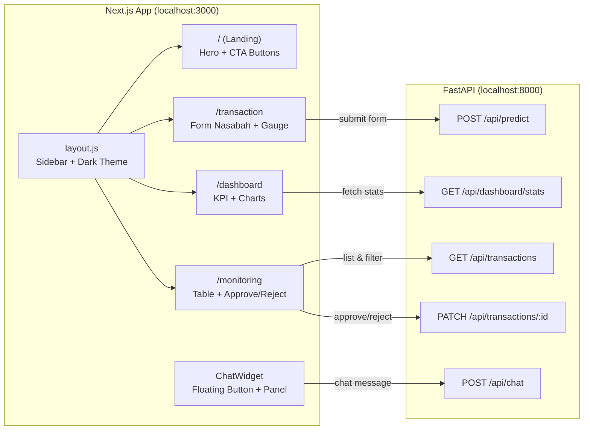

# Frontend Implementation Plan — Transaction Fraud Monitoring System

## Overview

Frontend dibangun dengan **Next.js (App Router)** yang terhubung ke backend FastAPI di `localhost:8000`. Terdiri dari 4 halaman utama + 1 widget chatbot.

---

## Arsitektur Frontend



---

## Design System

### Color Palette (Dark Theme)

| Token | Hex | Penggunaan |
|:---|:---|:---|
| `--bg-primary` | `#0a0e1a` | Background utama (sangat gelap navy) |
| `--bg-secondary` | `#111827` | Background card/sidebar |
| `--bg-glass` | `rgba(255,255,255,0.05)` | Glassmorphism cards |
| `--border` | `rgba(255,255,255,0.08)` | Border halus |
| `--text-primary` | `#f1f5f9` | Teks utama |
| `--text-secondary` | `#94a3b8` | Teks label/subtitle |
| `--accent` | `#6366f1` | Indigo — tombol, link, active state |
| `--accent-glow` | `rgba(99,102,241,0.15)` | Glow effect |
| `--success` | `#22c55e` | Approved, LOW risk |
| `--warning` | `#f59e0b` | Pending, MEDIUM risk |
| `--danger` | `#ef4444` | Rejected, HIGH risk |

### Typography

- **Font**: Inter (Google Fonts)
- **Headings**: 600-700 weight, letter-spacing tight
- **Body**: 400 weight, 16px base

### Visual Effects

- **Glassmorphism**: `backdrop-filter: blur(12px)` + border semi-transparan
- **Hover**: Scale 1.02 + shadow glow pada cards
- **Transitions**: `0.2s ease` pada semua interaksi
- **Gradient accent**: `linear-gradient(135deg, #6366f1, #8b5cf6)` untuk elemen penting

---

## Halaman per Halaman

### Page 1: Landing Page (`/`)

Halaman pertama saat user membuka app. Berfungsi sebagai gateway ke 2 role berbeda.

```
+------------------------------------------------------------------+
|  SIDEBAR  |                                                       |
|           |    [Logo + Title]                                     |
|  - Home   |    Fraud Detection Monitoring System                  |
|  - Form   |                                                       |
|  - Dash   |    "Sistem monitoring transaksi berbasis              |
|  - Monitor|     Machine Learning untuk deteksi fraud"             |
|           |                                                       |
|           |    [  Nasabah  ]    [  Bank Dashboard  ]              |
|           |    (link to         (link to                          |
|           |     /transaction)    /dashboard)                      |
|           |                                                       |
|           |    --- Quick Stats (mini cards) ---                   |
|           |    Total Tx: 245  |  Fraud Rate: 12%  |  Pending: 8  |
+------------------------------------------------------------------+
```

**Komponen**: Hero section + 2 CTA buttons + mini stats dari API

---

### Page 2: Transaction Form (`/transaction`)

Halaman untuk nasabah menginput data transaksi. Setelah submit, menampilkan hasil prediksi fraud.

```
+------------------------------------------------------------------+
|  SIDEBAR  |                                                       |
|           |  [Card: Form Transaksi Baru]                         |
|           |  +---------------------------------------------------+
|           |  | Age: [___]    Transaction Amount: [___]            |
|           |  | Account Balance: [___]    Transactions Today: [___]|
|           |  | Foreign Transaction: [Toggle]                     |
|           |  | Transaction Hour: [Dropdown 0-23]                 |
|           |  | Previous Fraud Flag: [Toggle]                     |
|           |  | Merchant Distance: [___] km                       |
|           |  | Merchant Risk Score: [Slider 0-10]                |
|           |  |                                                   |
|           |  |              [ Submit Transaction ]               |
|           |  +---------------------------------------------------+
|           |                                                       |
|           |  [Card: Hasil Prediksi] (muncul setelah submit)      |
|           |  +---------------------------------------------------+
|           |  |                                                   |
|           |  |  [=====GAUGE METER=====]                          |
|           |  |  Fraud Probability: 87.2%                         |
|           |  |  Risk Level: HIGH                                 |
|           |  |  Status: Pending Review                           |
|           |  |                                                   |
|           |  +---------------------------------------------------+
+------------------------------------------------------------------+
```

**Komponen**:
- `TransactionForm` — form input dengan validasi
- `FraudGauge` — gauge meter semi-circular (CSS + JS, tanpa library)
  - Hijau (0-49%) → Kuning (50-79%) → Merah (80-100%)
  - Animasi needle dari 0 ke nilai aktual

**API**: `POST /api/predict` → response berisi `fraud_probability`, `risk_level`

---

### Page 3: Bank Dashboard (`/dashboard`)

Dashboard analitik untuk petugas bank. Auto-refresh setiap 30 detik.

```
+------------------------------------------------------------------+
|  SIDEBAR  |                                                       |
|           |  --- KPI Cards (4 cards horizontal) ---              |
|           |  +----------+ +----------+ +----------+ +----------+ |
|           |  | Total Tx | | Fraud %  | | Approved | | Pending  | |
|           |  |   245    | |  12.3%   | |   180    | |    8     | |
|           |  +----------+ +----------+ +----------+ +----------+ |
|           |                                                       |
|           |  --- Charts (2 column grid) ---                      |
|           |  +------------------------+ +------------------------+|
|           |  | Fraud Distribution     | | Risk Level             ||
|           |  | by Hour (Bar Chart)    | | Distribution (Doughnut)||
|           |  |                        | |                        ||
|           |  | [chart area]           | | [chart area]           ||
|           |  +------------------------+ +------------------------+|
|           |                                                       |
|           |  --- Recent Transactions (table) ---                 |
|           |  | ID | Amount | Prob  | Risk   | Status  | Time    | |
|           |  | 12 | 9500   | 0.92  | HIGH   | pending | 14:23  | |
|           |  | 11 | 150    | 0.08  | LOW    | approved| 14:20  | |
|           |  | ...                                               | |
+------------------------------------------------------------------+
```

**Komponen**:
- `KPICard` — card dengan icon, label, value, + micro-animation count-up
- `FraudByHourChart` — Bar chart (Chart.js)
- `RiskDistributionChart` — Doughnut chart (Chart.js)
- `RecentTransactionsTable` — 10 transaksi terakhir

**API**: `GET /api/dashboard/stats` (auto-refresh 30s)

**Library**: `chart.js` + `react-chartjs-2`

---

### Page 4: Monitoring Page (`/monitoring`)

Halaman untuk review dan approve/reject transaksi satu per satu.

```
+------------------------------------------------------------------+
|  SIDEBAR  |                                                       |
|           |  --- Filters ---                                     |
|           |  Status: [All | Pending | Approved | Rejected]      |
|           |  Search: [______________]                            |
|           |                                                       |
|           |  --- Transaction Table ---                            |
|           |  +------------------------------------------------------+
|           |  | ID | Age | Amount  | Prob  | Risk | Status |Action  |
|           |  |----|-----|---------|-------|------|--------|--------|
|           |  |  1 | 25  | 9,500   | 0.99  | HIGH | pend.  | [A][R] |  <- row merah
|           |  |  2 | 45  | 150     | 0.01  | LOW  | pend.  | [A][R] |  <- row hijau
|           |  |  3 | 33  | 2,300   | 0.62  | MED  | appr.  |  ---   |  <- row kuning
|           |  +------------------------------------------------------+
|           |                                                       |
|           |  [< Prev]  Page 1 of 5  [Next >]                    |
+------------------------------------------------------------------+
```

**Komponen**:
- `StatusFilter` — tab buttons untuk filter by status
- `TransactionTable` — tabel dengan color-coded rows
- `ActionButtons` — Approve (hijau) / Reject (merah) per row
- `Pagination` — navigasi halaman

**API**:
- `GET /api/transactions?status=pending&limit=20&offset=0`
- `PATCH /api/transactions/{id}` (body: `{"status": "approved"}`)

**UX**: Setelah approve/reject, row ter-update tanpa refresh halaman (optimistic update)

---

### Chatbot Widget (Global Component)

Muncul di semua halaman sebagai floating button di pojok kanan bawah.

```
                                    +---------------------------+
                                    | Fraud Detection Assistant |
                                    |---------------------------|
                                    | [Bot] Halo! Ada yang bisa |
                                    |       saya bantu?         |
                                    |                           |
                                    |   [User] Berapa total     |
                                    |   transaksi pending?      |
                                    |                           |
                                    | [Bot] Saat ini ada 8      |
                                    |       transaksi pending.  |
                                    |---------------------------|
                                    | [________________] [Send] |
                                    +---------------------------+
                                                    [Chat Icon] <- floating button
```

**Komponen**: `ChatWidget` — floating button + expandable panel
**API**: `POST /api/chat` (akan diimplementasi di Phase 7)
**Catatan**: Di Phase 2-5 ini, widget akan tampil tapi endpoint chat belum aktif. Akan menampilkan pesan "Coming soon".

---

## File Structure

```
frontend/
├── package.json
├── next.config.js
├── jsconfig.json
└── src/
    ├── app/
    │   ├── layout.js               # Root layout: sidebar + font + metadata
    │   ├── globals.css             # Design system: CSS variables, components
    │   ├── page.js                 # Landing page (Hero + CTA)
    │   ├── transaction/
    │   │   └── page.js             # Form nasabah + Fraud Gauge
    │   ├── dashboard/
    │   │   └── page.js             # KPI cards + Charts + Recent table
    │   └── monitoring/
    │       └── page.js             # Transaction table + Approve/Reject
    ├── components/
    │   ├── Sidebar.js              # Navigation sidebar
    │   ├── KPICard.js              # Stat card with count-up animation
    │   ├── FraudGauge.js           # Semi-circular gauge meter
    │   ├── TransactionTable.js     # Reusable table component
    │   └── ChatWidget.js           # Floating chatbot widget
    └── lib/
        └── api.js                  # API helper functions (fetch wrapper)
```

---

## Execution Plan

| Step | Apa yang dibuat | Estimasi |
|:---|:---|:---|
| **2a** | Init Next.js + `globals.css` (design system) | 5 menit |
| **2b** | `layout.js` + `Sidebar.js` | 5 menit |
| **2c** | `lib/api.js` (API helper) | 2 menit |
| **3** | `/transaction` page + `FraudGauge` | 10 menit |
| **4** | `/dashboard` page + `KPICard` + Charts | 10 menit |
| **5** | `/monitoring` page + `TransactionTable` | 10 menit |
| **6** | `ChatWidget.js` (UI only, no backend yet) | 5 menit |
| **7** | Landing page `/` | 5 menit |
| **8** | Test semua halaman via browser | 5 menit |

---

## Open Questions

> [!IMPORTANT]
> 1. **Bahasa UI**: Apakah label di UI menggunakan **Bahasa Indonesia** atau **English**?
> 2. **Sidebar collapsible**: Apakah sidebar perlu bisa di-collapse (minimize) untuk layar kecil?
> 3. **Dark mode only** atau perlu toggle light/dark mode?
