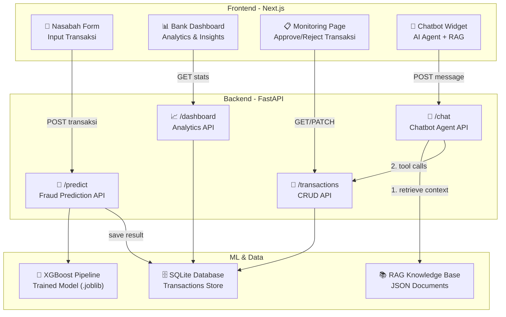
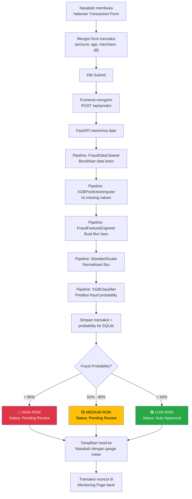
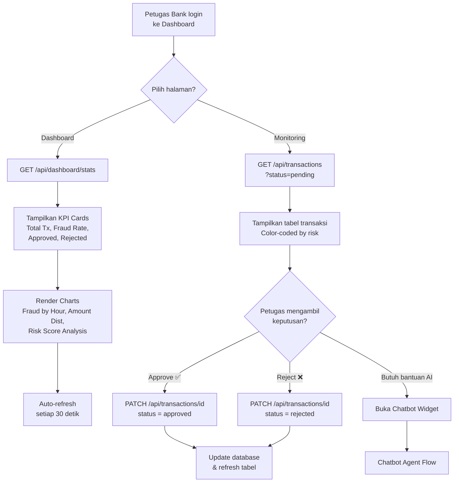
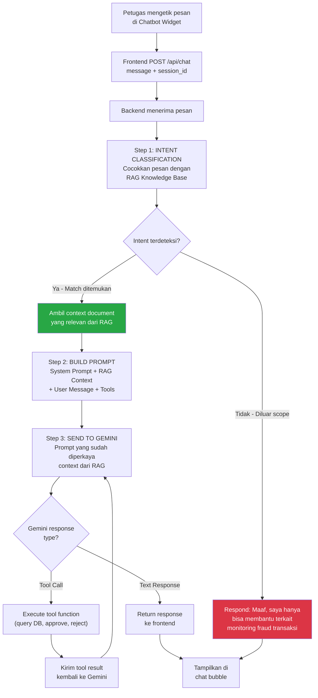
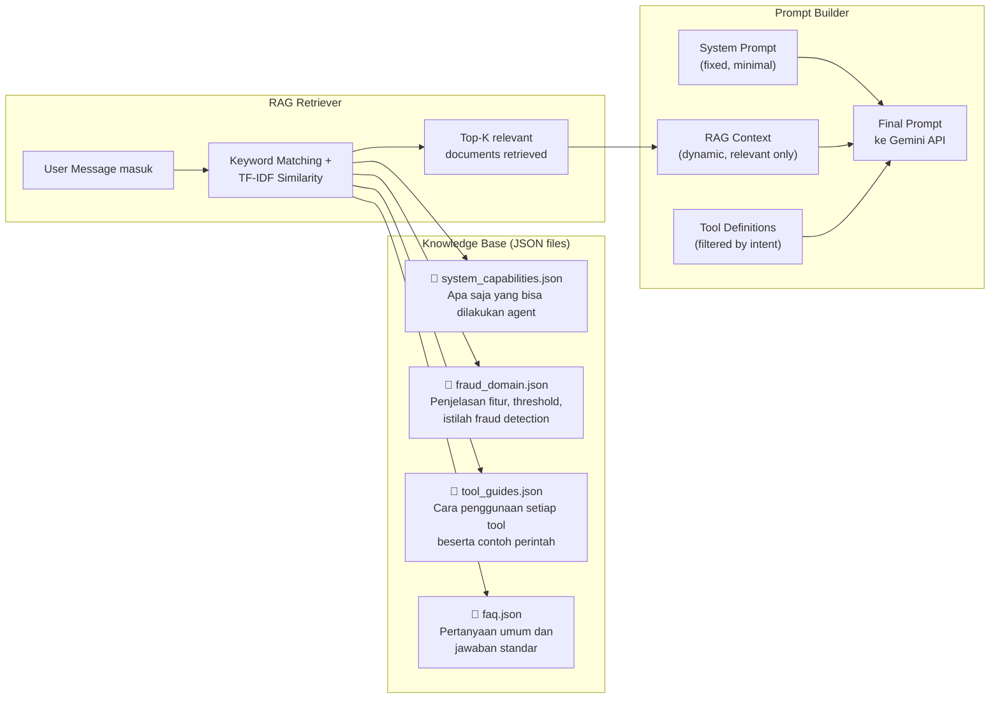
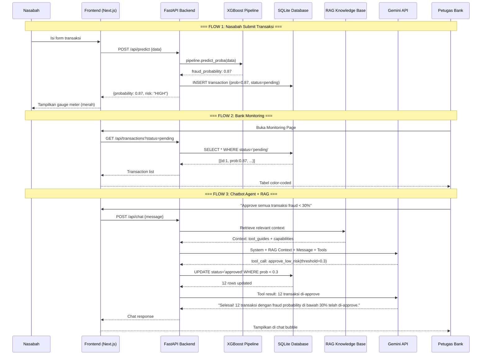

# Transaction Fraud Monitoring System

## Overview

Membangun **full-stack production ML system** untuk monitoring fraud transaksi. System ini terdiri dari 4 komponen utama yang saling terhubung, memanfaatkan ML pipeline (XGBoost) yang sudah ada.

---

## System Flowcharts

### 1. System Architecture (High-Level)



### 2. Nasabah Transaction Flow



### 3. Bank Dashboard & Monitoring Flow



### 4. AI Chatbot Agent + RAG Flow



### 5. RAG Pipeline Detail



### 6. End-to-End Data Flow



---

## User Review Required

> [!IMPORTANT]
> **Technology Stack Decision**: Saya merekomendasikan stack berikut berdasarkan skala project ini. Mohon review:
> - **Frontend**: Next.js (React) — karena butuh routing multi-page (nasabah, dashboard, monitoring, dll)
> - **ML Backend**: FastAPI (Python) — karena model ML Anda sudah di Python, dan FastAPI sangat cocok untuk serving ML models
> - **Database**: SQLite — ringan, cukup untuk demo/belajar production, tanpa perlu setup database server
> - **Chatbot AI**: OpenAI API — sebagai LLM backend untuk chatbot agent (function calling)
> - **RAG**: Lightweight JSON-based retrieval (tanpa vector DB) — hemat token, tetap on-context

> [!WARNING]
> **API Key Diperlukan**: Untuk fitur chatbot agent, Anda memerlukan **OpenAI API key** (dari [platform.openai.com](https://platform.openai.com)). Tanpa ini, fitur chatbot tidak akan berfungsi, tetapi seluruh sistem lainnya tetap bekerja normal.

## Open Questions

> [!IMPORTANT]
> 1. **Apakah Anda sudah punya OpenAI API key?** Jika belum, chatbot bisa kita implementasi belakangan.
> 2. **Apakah Anda ingin menggunakan data simulasi real-time** (transaksi baru masuk setiap beberapa detik) atau cukup form manual saja untuk demo?
> 3. **Preferensi bahasa UI**: Apakah label dan teks di UI menggunakan **Bahasa Indonesia** atau **English**?

---

## Proposed Changes

### Component 1: ML Service (FastAPI Backend)

Komponen ini meng-expose model XGBoost yang sudah Anda latih sebagai REST API, dan menyimpan hasil prediksi ke database.

#### [NEW] [main.py](file:///c:/UNISKA/projects/fraud_detection/ml-service/app/main.py)

FastAPI application entry point:
- `POST /api/predict` — Menerima data transaksi, menjalankan pipeline (clean → impute → feature eng → scale → predict), mengembalikan probabilitas fraud, dan menyimpan ke database
- `GET /api/dashboard/stats` — Mengembalikan statistik agregat (total transaksi, fraud rate, distribusi per jam, dll)
- `GET /api/transactions` — List transaksi dengan filter (status, fraud probability range)
- `PATCH /api/transactions/{id}` — Update status transaksi (approved/rejected/pending)
- `POST /api/chat` — Endpoint chatbot agent
- CORS middleware untuk koneksi dengan frontend Next.js

#### [NEW] [database.py](file:///c:/UNISKA/projects/fraud_detection/ml-service/app/database.py)

SQLite database setup:
- Tabel `transactions`: menyimpan setiap transaksi beserta fraud probability, status (pending/approved/rejected), dan timestamp
- Menggunakan `sqlite3` (built-in Python, tanpa dependency tambahan)

#### [NEW] [model_loader.py](file:///c:/UNISKA/projects/fraud_detection/ml-service/app/model_loader.py)

Utility untuk load trained pipeline:
- Load model `.joblib` saat startup (singleton pattern)
- Fungsi `predict_fraud(data)` yang menjalankan full pipeline dan mengembalikan probabilitas

#### [NEW] [train_and_save.py](file:///c:/UNISKA/projects/fraud_detection/ml-service/train_and_save.py)

Script untuk training dan menyimpan model:
- Menggunakan pipeline dari `src/fraud_training_pipeline.py` yang sudah ada
- Export trained pipeline ke `ml-service/model/fraud_pipeline.joblib`
- Print evaluation metrics setelah training

#### [MODIFY] [fraud_training_pipeline.py](file:///c:/UNISKA/projects/fraud_detection/src/fraud_training_pipeline.py)

- Menambahkan `FraudFeatureEngineer` ke dalam pipeline (sudah ada di `feature_engineer.py`)
- Un-comment dan finalisasi pipeline build function

#### [NEW] [requirements.txt](file:///c:/UNISKA/projects/fraud_detection/ml-service/requirements.txt)

```
fastapi
uvicorn
pandas
numpy
scikit-learn
xgboost
joblib
openai
python-dotenv
```

---

### Component 2: Frontend — Nasabah Transaction Form

Halaman dimana nasabah/customer menginput data transaksi dan langsung mendapat feedback apakah transaksi terdeteksi fraud.

#### [NEW] [page.js](file:///c:/UNISKA/projects/fraud_detection/frontend/src/app/page.js)

Landing page / redirect ke form transaksi.

#### [NEW] [transaction/page.js](file:///c:/UNISKA/projects/fraud_detection/frontend/src/app/transaction/page.js)

Form transaksi nasabah:
- Input fields sesuai fitur dataset: age, transaction_amount, account_balance, num_transactions_today, is_foreign_transaction, transaction_hour, merchant_distance_km, merchant_risk_score, prev_fraud_flag
- Validasi client-side (range, required fields)
- Submit → `POST /api/predict` → Tampilkan hasil (fraud probability, risk level gauge)
- Animasi visual: gauge meter untuk fraud probability (hijau → kuning → merah)
- Desain premium: glassmorphism card, gradient background

---

### Component 3: Frontend — Bank Dashboard & Monitoring

Halaman internal untuk petugas bank/kreditur.

#### [NEW] [dashboard/page.js](file:///c:/UNISKA/projects/fraud_detection/frontend/src/app/dashboard/page.js)

Dashboard analytics:
- **KPI Cards**: Total transaksi, fraud rate %, total approved, total rejected
- **Chart: Fraud Distribution by Hour** — Bar chart menunjukkan jam-jam rawan fraud
- **Chart: Transaction Amount Distribution** — Histogram amount fraud vs normal
- **Chart: Risk Score Heatmap** — Korelasi merchant_risk_score vs fraud
- **Recent Transactions Table** — 10 transaksi terakhir dengan status
- Auto-refresh setiap 30 detik
- Library chart: **Chart.js** (ringan, tanpa dependency berat)

#### [NEW] [monitoring/page.js](file:///c:/UNISKA/projects/fraud_detection/frontend/src/app/monitoring/page.js)

Halaman monitoring transaksi:
- Tabel semua transaksi dengan kolom: ID, amount, fraud probability, status, timestamp
- **Color-coded rows**: merah (>80% fraud), kuning (50-80%), hijau (<50%)
- **Filter**: by status (pending/approved/rejected), by probability range
- **Action buttons**: Approve ✅ / Reject ❌ per row
- Pagination dan search
- Badge counter untuk pending transactions

#### [NEW] [layout.js](file:///c:/UNISKA/projects/fraud_detection/frontend/src/app/layout.js)

Root layout:
- Sidebar navigation (Dashboard, Monitoring, Transaction Form)
- Dark mode design
- Responsive layout

#### [NEW] [globals.css](file:///c:/UNISKA/projects/fraud_detection/frontend/src/app/globals.css)

Design system:
- CSS variables untuk color palette (dark theme)
- Glassmorphism utilities
- Animation keyframes
- Typography (Google Fonts: Inter)
- Card, button, table, form component styles

---

### Component 4: AI Chatbot Agent with RAG

Widget chatbot yang bisa diakses dari halaman manapun di dashboard bank. Menggunakan **RAG (Retrieval-Augmented Generation)** agar agent tetap on-context dan hemat token.

#### Mengapa RAG?

| Tanpa RAG | Dengan RAG |
|:---|:---|
| System prompt harus berisi SEMUA instruksi sekaligus | System prompt minimal, context ditambahkan secara dinamis |
| Setiap request kirim ~2000+ token context | Hanya kirim ~300-500 token context yang relevan |
| LLM bisa "halusinasi" tentang fitur yang tidak ada | LLM hanya tahu apa yang ada di knowledge base |
| Biaya token tinggi | Hemat 60-70% token per request |

#### [NEW] [chatbot.py](file:///c:/UNISKA/projects/fraud_detection/ml-service/app/chatbot.py)

Chatbot agent logic:
- Integrasi dengan Google Gemini API
- RAG-augmented prompt building
- Tool definitions (OpenAI function calling): `get_transactions`, `approve_transaction`, `reject_transaction`, `get_dashboard_stats`, `get_transactions_by_risk`
- Agent loop: User Message → RAG Retrieve → Build Prompt → OpenAI → Tool Call → Execute → Respond

#### [NEW] [rag.py](file:///c:/UNISKA/projects/fraud_detection/ml-service/app/rag.py)

Lightweight RAG engine:
- **TF-IDF based retriever** menggunakan `scikit-learn` (sudah ada sebagai dependency, zero tambahan)
- Load knowledge base dari JSON files saat startup
- `retrieve(query, top_k=3)` → mengembalikan dokumen paling relevan
- Tidak memerlukan vector database (ChromaDB, Pinecone, dll) — cukup untuk skala ini

#### [NEW] [knowledge/](file:///c:/UNISKA/projects/fraud_detection/ml-service/knowledge/)

Knowledge base documents (JSON files):

| File | Isi | Contoh Entry |
|:---|:---|:---|
| `system_capabilities.json` | Apa yang bisa dan tidak bisa dilakukan agent | "Saya bisa melihat, menyetujui, dan menolak transaksi" |
| `fraud_domain.json` | Penjelasan fitur, threshold, istilah fraud | "merchant_risk_score: skor 0-10, di atas 7 dianggap high risk" |
| `tool_guides.json` | Cara menggunakan setiap tool + contoh perintah | "Untuk approve: 'setujui transaksi ID 5'" |
| `faq.json` | Pertanyaan umum & jawaban standar | "Apa itu fraud probability? → Skor 0-1 dari model XGBoost..." |

#### [NEW] [ChatWidget.js](file:///c:/UNISKA/projects/fraud_detection/frontend/src/components/ChatWidget.js)

Frontend chatbot widget:
- Floating button di pojok kanan bawah (seperti Intercom/Crisp)
- Panel chat yang slide-up saat diklik
- Mendukung perintah natural language, contoh:
  - *"Tampilkan semua transaksi fraud hari ini"*
  - *"Approve transaksi ID 15"*
  - *"Berapa total transaksi pending?"*
  - *"Reject semua transaksi dengan fraud probability di atas 95%"*
- Menampilkan response dalam format chat bubbles
- Loading animation saat menunggu response

---

## Architecture Summary

```
fraud_detection/
├── feature.md                          # Existing - dokumentasi fitur
├── correction.md                       # Existing
├── src/                                # Existing - ML source code
│   ├── fraud_training_pipeline.py      # MODIFY - add feature engineering
│   ├── feature_engineer.py             # Existing
│   └── xgb_imputer_eval.py            # Existing
├── ml-service/                         
│   ├── data/credit_fraud.csv           # Existing - dataset
│   ├── notebook/                       # Existing - Jupyter notebooks
│   ├── model/                          # NEW - saved model artifacts
│   │   └── fraud_pipeline.joblib       
│   ├── app/                            # NEW - FastAPI application
│   │   ├── main.py                     # API endpoints
│   │   ├── database.py                 # SQLite setup
│   │   ├── model_loader.py             # Load trained model
│   │   ├── chatbot.py                  # Agent + OpenAI integration
│   │   └── rag.py                      # RAG retrieval engine
│   ├── knowledge/                      # NEW - RAG knowledge base
│   │   ├── system_capabilities.json    
│   │   ├── fraud_domain.json           
│   │   ├── tool_guides.json            
│   │   └── faq.json                    
│   ├── train_and_save.py               # NEW - training script
│   ├── requirements.txt                # NEW
│   └── .env                            # NEW - GEMINI_API_KEY
└── frontend/                           # NEW - Next.js application
    ├── package.json
    ├── next.config.js
    └── src/
        ├── app/
        │   ├── layout.js               # Root layout + sidebar
        │   ├── globals.css             # Design system
        │   ├── page.js                 # Landing page
        │   ├── transaction/page.js     # Nasabah form
        │   ├── dashboard/page.js       # Bank dashboard
        │   └── monitoring/page.js      # Transaction monitoring
        └── components/
            └── ChatWidget.js           # Chatbot widget
```

## Execution Order

Saya akan mengerjakan dalam urutan berikut:

1. **Phase 1 — ML Backend** (FastAPI + model serving + database)
   - Train & save model
   - Setup FastAPI endpoints
   - Test prediction API
   
2. **Phase 2 — Frontend Foundation** (Next.js setup + design system + layout)
   - Initialize Next.js project
   - Build design system (CSS)
   - Create shared layout & navigation
   
3. **Phase 3 — Nasabah Form** (transaction input + prediction result)
   
4. **Phase 4 — Bank Dashboard** (analytics + charts)

5. **Phase 5 — Monitoring Page** (transaction table + approve/reject)

6. **Phase 6 — RAG Knowledge Base** (build JSON documents)

7. **Phase 7 — Chatbot Agent** (RAG engine + Gemini integration + widget)

## Verification Plan

### Automated Tests
1. **ML API**: Test `POST /api/predict` dengan sample data → verify response memiliki `fraud_probability`
2. **Database**: Verify transaksi tersimpan setelah predict
3. **Dashboard API**: Verify `GET /api/dashboard/stats` mengembalikan data yang benar
4. **RAG**: Test retrieval accuracy — query "approve transaksi" → harus return `tool_guides.json`
5. **Chatbot**: Test agent loop dengan mock tools
6. **Frontend**: Visual verification via browser — setiap halaman diakses dan di-screenshot

### Manual Verification
- Jalankan `ml-service` (FastAPI) dan `frontend` (Next.js) secara bersamaan
- Submit transaksi dari form nasabah → lihat muncul di monitoring page
- Approve/reject dari monitoring → lihat dashboard ter-update
- Test chatbot: perintah on-topic → harus merespons dengan aksi
- Test chatbot: perintah off-topic → harus menolak dengan sopan
